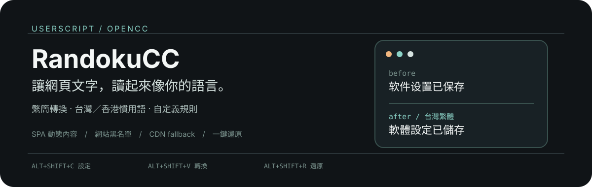
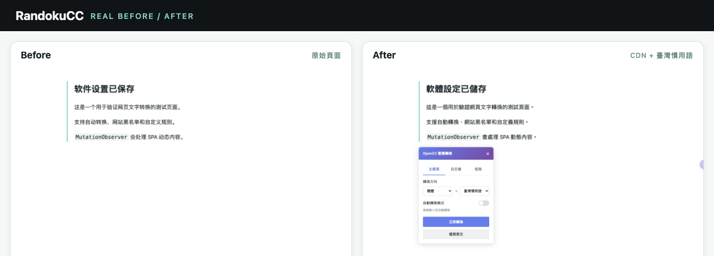

  

# RandokuCC 繁簡轉換器

以 [OpenCC](https://github.com/BYVoid/OpenCC) 為基礎的瀏覽器 Userscript，讓網頁內容依照你的閱讀習慣轉換成繁體中文、簡體中文、台灣慣用語或香港慣用語。

  

_實際執行結果：左側為原始頁面，右側為 CDN + 台灣慣用語轉換後的頁面與控制面板。_

## 它能做什麼

- 整頁簡繁／繁簡轉換（台灣／香港慣用語）
- 自動轉換模式（支援 SPA 動態內容）
- 自定義保護詞組（不轉換）
- 自定義轉換規則
- 網站黑名單（Regex）
- 一鍵還原原文
- 可拖移的浮動按鈕，位置自動記憶
- CDN 失效時使用內建字典備援

## 轉換方向

- 簡體 → 台灣繁體
- 簡體 → 台灣慣用語（軟體、硬碟、印表機⋯）
- 簡體 → 香港繁體
- 繁體 → 簡體

## 安裝與第一次使用

1. 安裝瀏覽器擴充：[Tampermonkey](https://www.tampermonkey.net/)（Chrome／Edge／Firefox／Safari）。
2. 開啟 [randoku-cc.user.js](./randoku-cc.user.js) 並交給 Tampermonkey 安裝。
3. 開啟任一網頁，使用浮動按鈕或快捷鍵開始轉換。

## 快捷鍵

| 快捷鍵 | 功能 |
|--------|------|
| `Alt+Shift+C` | 開啟設定面板 |
| `Alt+Shift+V` | 立即轉換 |
| `Alt+Shift+R` | 還原原文 |

## 為什麼它適合 Userscript

RandokuCC 直接在瀏覽器頁面上運作，不需要額外服務或專用後端；它會觀察動態內容、保存原始文字，並把設定交給 Tampermonkey 管理。這讓它可以從靜態頁面一路支援到 SPA，而不必為每個網站製作獨立擴充套件。

## 技術

- 轉換引擎：[opencc-js](https://github.com/nk2028/opencc-js)（CDN）＋內建字典（fallback）
- 自動轉換：`MutationObserver`＋debounce
- 設定儲存：Tampermonkey `GM_getValue`／`GM_setValue`
- 原始文字保存：`WeakMap`（自動 GC）

## License

MIT
